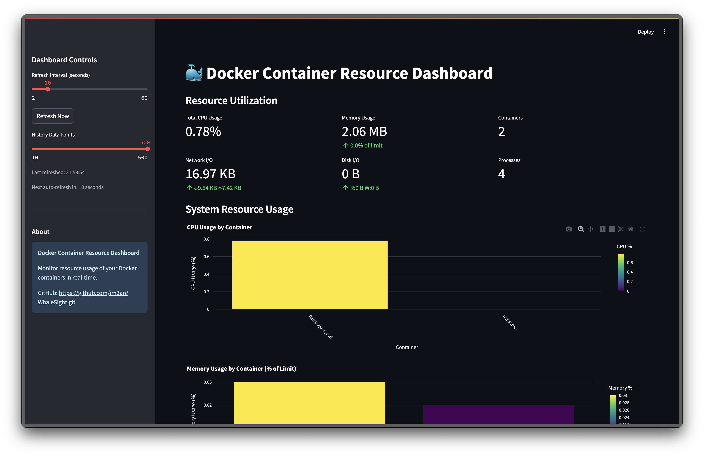
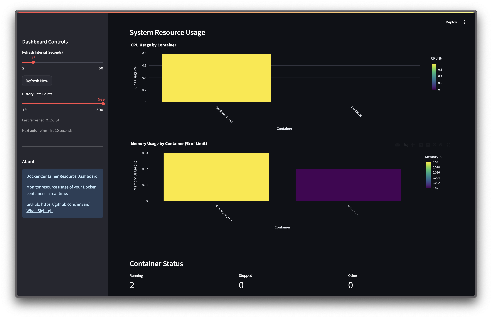
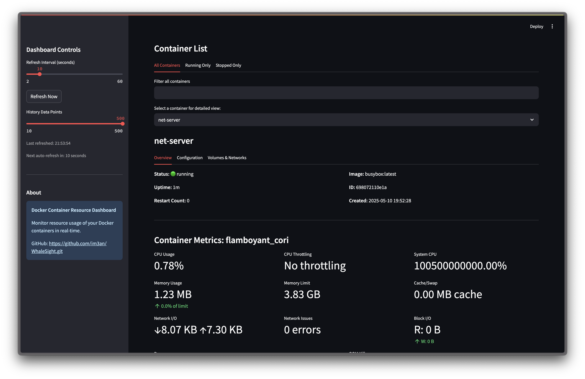
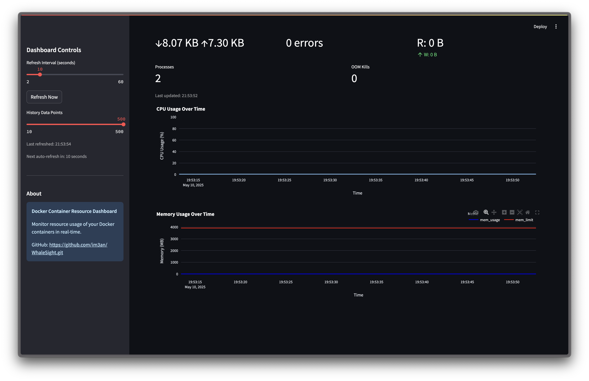

# 🐳 WhaleSight - Docker Container Resource Dashboard

A lightweight, real-time dashboard for monitoring Docker container resource usage across Linux, macOS, and Windows.

## Features

- 📊 Real-time monitoring of container CPU, memory, network, and disk usage
- 📈 Historical charts of resource usage over time
- 🔍 Filter and search containers by name or image
- 📱 Responsive design works on desktop and mobile
- 🚀 Easy to install and use with minimal dependencies
- 💻 Cross-platform (works on Linux, macOS, and Windows)

## Screenshots

<div align="center">
  
  <p><i>Dashboard Overview - Container monitoring at a glance</i></p>

  
  <p><i>Detailed resource metrics with real-time updates</i></p>

  
  <p><i>Container configuration and operational details</i></p>

  
  <p><i>Resource usage trends and historical performance</i></p>
</div>

## Requirements

- Python 3.8+
- Docker (running on local machine or accessible via API)
- Docker SDK for Python
- Streamlit

## Installation

1. Clone this repository:
   ```bash
   git clone https://github.com/yourusername/docker-resource-dashboard.git
   cd docker-resource-dashboard
   ```

2. Install the required dependencies:
   ```bash
   pip install -r requirements.txt
   ```

## Usage

1. Make sure Docker is running on your system
2. Start the dashboard:
   ```bash
   streamlit run app.py
   ```
3. Open your browser and navigate to `http://localhost:8501`

## Configuration

You can customize the dashboard by adjusting the following settings in the sidebar:
- **Refresh Interval**: How often the dashboard updates (in seconds)
- **History Data Points**: How many historical data points to keep for trend charts

## Development

This project uses:
- **Python** for the backend and Docker API integration
- **Streamlit** for the web interface
- **Plotly** for interactive charts
- **Docker SDK for Python** for Docker API communication

### Project Structure

```
docker-dashboard/
├── README.md
├── requirements.txt
├── app.py              # Main Streamlit application
├── docker_stats.py     # Docker stats collection module
└── dashboard/          # Dashboard components
    ├── __init__.py
    ├── container_list.py
    ├── metrics.py
    └── charts.py
```

## Troubleshooting

### Can't connect to Docker?
- Make sure Docker is running
- Check that your user has permissions to access the Docker socket
- On Linux, you might need to run with `sudo` or add your user to the Docker group

### Dashboard running slow?
- Increase the refresh interval
- Reduce the number of history data points
- Check if you have many containers running

## Contributing

Contributions are welcome! Please feel free to submit a Pull Request.

1. Fork the repository
2. Create your feature branch (`git checkout -b feature/amazing-feature`)
3. Commit your changes (`git commit -m 'Add some amazing feature'`)
4. Push to the branch (`git push origin feature/amazing-feature`)
5. Open a Pull Request

## License

This project is licensed under the MIT License - see the LICENSE file for details.

## Acknowledgments

- The Docker team for their excellent API
- The Streamlit team for making beautiful dashboards easy to create

